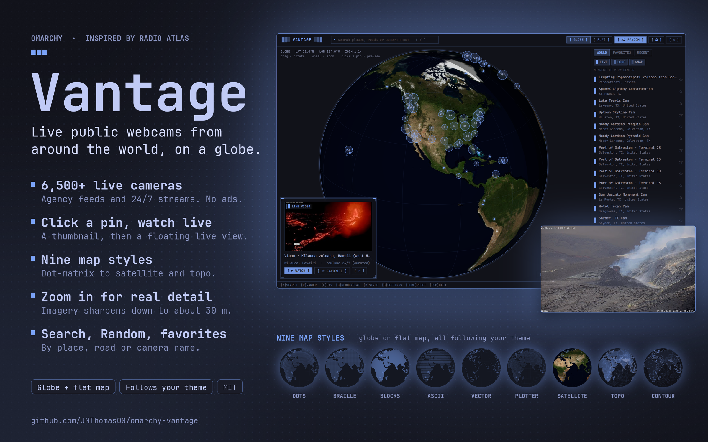
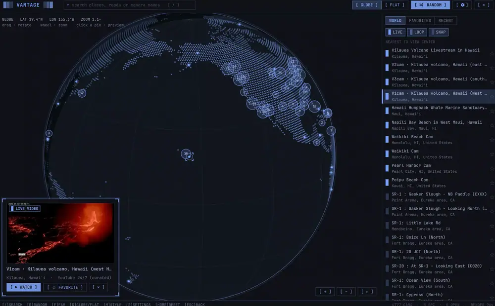
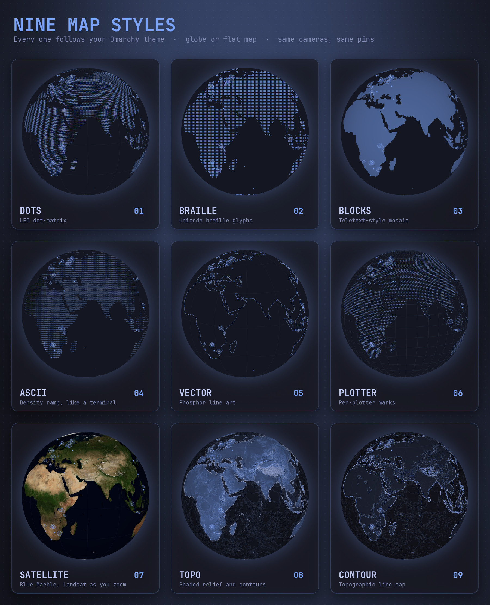

# Vantage

**Live public webcams from around the world on a spinning globe, for [Omarchy](https://omarchy.org).**

Spin the world, click a pin for a thumbnail, click the thumbnail to open the live
stream in a floating window. Search by place, road or camera name, hit **Random**
to be dropped somewhere unexpected, and star the ones you like. Nine map styles, from
LED dot-matrix to satellite imagery and topographic contours that sharpen as you zoom.
**No ads, ever**: every camera comes from an official agency feed or its operator's own
stream, and nothing is loaded through a publisher's web player.



<p align="center">
  
</p>

> **Inspired by [Radio Atlas](https://github.com/AksharP5/omarchy-radio-atlas)** by
> [Akshar Patel](https://github.com/AksharP5). Radio Atlas lets you *"explore live radio on a
> rotatable globe from the Omarchy bar"*, and it is the reason this plugin exists: Vantage asks what
> the same idea looks like for public webcams. Thank you, Akshar, for the spark. If you like globes
> on your bar, go give Radio Atlas a star.

## What you get

- **A rotatable, zoomable globe** with a **flat-map toggle** for browsing dense
  regions, in **nine map styles** (below). Drag to rotate (with momentum), wheel
  to zoom, click a cluster to zoom into it. Optional slow auto-rotate (Settings, off
  by default).
- **~6,500 cameras** across 7 sources (see below), clustered into count bubbles
  that split as you zoom in.
- **Thumbnail preview** on click. Click it (or press Enter) to open the live view.
  Pins encode what you'll get by shade: `█ LIVE` video, `▒ LOOP` a short video
  clip, `░ SNAP` a still image that refreshes.
- **Search** (`/`) across names, places, roads, sources and countries.
- **Random** (`R`, the button, or middle-click the bar icon) picks a random live
  stream, choosing the *source* first so 2,000 freeway cams don't drown out the
  curated world cams. An animated arc lights the way from where you were.
- **Favorites** (`F`, or the star) and **Recent**, kept across restarts.
- **Floating live view.** Video opens in `mpv` (Omarchy floats it for you); still-image
  cameras open in a Vantage window that refreshes on the camera's own schedule. If a
  live feed is dead, Vantage falls back to the latest still and tells you.
- Follows your theme live: one accent hue, monospace throughout, dark or light.

## Install

```bash
omarchy plugin add https://github.com/JMThomas00/omarchy-vantage.git --enable
```

Requires `mpv` and `python3` (both ship with Omarchy). If `mpv` is missing Vantage says so and shows stills instead. The curated YouTube cams
also need `yt-dlp` (`omarchy pkg add yt-dlp`); everything else works without it.

The bar icon lands in the left section; move it with `omarchy bar move jmthomas00.vantage --section right`.

## Keys

| Key | Action |
|---|---|
| `/` | Search |
| `R` | Random camera |
| `F` | Favorite the selected camera |
| `Enter` | Open the selected camera's live view |
| `G` | Toggle globe / flat map |
| `M` | Cycle map style |
| `S` | Settings and sources |
| `+` / `-` | Zoom |
| `Home` | Reset the view (the same as the ⌂ button; on the flat map, the whole world centred) |
| `Esc` | Steps back one level at a time: settings, search, the selected camera, then **zoom out to the home view** (if zoomed in), then close |

From a keybinding:

```bash
omarchy-shell shell toggle jmthomas00.vantage
omarchy-shell shell summon jmthomas00.vantage '{"action":"random"}'
omarchy-shell shell summon jmthomas00.vantage '{"action":"watch","id":"yt:earthcam-times-square-north"}'
```

`select` works like `watch` but only shows the preview (add `"zoom": 2` to control the
zoom). Camera ids are in `~/.local/state/vantage/catalog.json`. Other actions:
`{"action":"style","value":"braille"}` (dots, braille, blocks, ascii, vector, plotter, satellite, topo, contour),
`{"action":"view","lat":24,"lon":-105,"zoom":1}` (fly the map to a view without selecting anything),
`{"action":"settings"}`, and a validated setter,
`{"action":"set","key":"palette","value":"green"}`, for `mapStyle`, `palette`, `autoRotate`,
`rotateIdleSeconds`, `vectorDetail` (low, medium, high, highest), `terminator`, `crtMap`, `radar`, `scanlines`, `showArcs`, `randomOpensStream`.

## Map styles

Pick one in Settings (`S`) or press `M` to cycle. All nine work on both the globe and
the flat map.



| Style | Look |
|---|---|
| **Dots** | LED dot-matrix: glowing squares on a lat/lon lattice (default) |
| **Braille** | Real Unicode braille glyphs (`⣿`), 2x4 sub-dots per character: the terminal-graphics look |
| **Blocks** | Teletext-style mosaic: a fixed grid of small square blocks (5 px) lit over land. Drawn on the GPU, so it keeps its size and moves smoothly while you drag or spin, and is the cheapest style to spin |
| **ASCII** | A `. : - = + * # % @` density ramp with limb shading, in small type that shrinks as you zoom |
| **Vector** | Phosphor line art: glowing coastlines and borders, like a vector CRT |
| **Plotter** | Pen-plotter `+` marks on graph paper, with registration ticks around the edge |
| **Satellite** | NASA Blue Marble true-colour imagery, drawn on the GPU (true colour, so it is the one style that is not single-accent) |
| **Contour** | A simplified topographic *line* map in the style of a USGS quad: thin contour lines with heavier index lines every fifth, a faint relief tint, and the coastline. The contour interval refines as you zoom, and it is drawn in your theme colours (accent lines on your panel colour) |
| **Topo** | A topographic map from global relief data: hillshading, contour lines every 500 m (heavier every 2 km), ocean depth and the coastline, all tinted from your theme's accent colour |

**Satellite, Topo and Contour** are drawn by a small GPU shader from a whole-planet texture
(4096x2048), so they cost almost no CPU and follow the globe/flat toggle, the day/night
terminator, the CRT overlay and every pin exactly like the other styles.

**They get sharper as you zoom.** Past a certain zoom, map tiles for just the visible area are
streamed in and blended over the world texture, and these three styles allow 4x deeper zoom than the rest:

| Style | Tiles | Finest detail |
|---|---|---|
| Satellite | NASA GIBS **Landsat WELD** annual true-colour composite | ~30 m: fields, reservoirs, city blocks |
| Topo / Contour | **AWS Terrain Tiles** (SRTM, USGS 3DEP, GMTED, ETOPO1 and others) | ~75 m elevation; contour interval, hillshade and lines refine as you zoom |

Where a tile has not arrived, does not exist, or the Landsat composite has no data (open ocean,
polar gaps) the world texture shows instead, so the map never has holes. Deep open water always uses
the world imagery, so the sea never looks half-loaded next to sharp coastlines.

**Loading is progressive and cached.** Tiles are fetched 24 at a time by `bin/tiles.py`, centre of the screen
first, and fade in. A new view loads on top of the previous one instead of blanking it. Everything is
cached in `~/.cache/vantage/tiles` (trimmed to about 400 MB), so revisiting an area is instant and works
offline; delete that folder to clear it. **Privacy:** zooming these styles
requests tiles for the area you are looking at from `gibs.earthdata.nasa.gov` and `s3.amazonaws.com`
(only integer tile numbers, no identifiers; and not at all for a tile already in the cache). Nothing is fetched in the other styles, or while zoomed out.
The world texture is loaded only while one of these styles is selected and released when you leave
(about +35 MB, plus tiles while zoomed in). If the texture or the shader cannot load, Vantage says so
and falls back to Dots. Needs OpenGL 3.2 or better (any GPU from the last decade).

## Flat map

The flat map is one world, not a repeating strip: it is centred when you open it, it cannot be
scrolled while the whole map fits the window (there is nothing to scroll to), and once you zoom in you
can pan only as far as the map's real edges. Zooming out pulls the view back inside.

## Transparency

Vantage follows Omarchy's own window transparency: it is translucent like your other windows
(per your `default-opacity` rules) and **SUPER+BACKSPACE** toggles it opaque and back.

## Palette and overlays

- **Palette**: draw everything in the theme accent (default) or in a named colour from the
  *current theme* (green, amber, yellow, cyan, blue, magenta, red). The colours are read from
  the active theme's `colors.toml`, so "green" is your theme's green, not a fixed hex, and it
  updates when you switch themes.
- **Day / night shading**: darkens the side of the map the sun isn't on, with a twilight band,
  from the real sun position (refreshes once a minute; about +2% CPU).
- **CRT scanlines over the whole map**: scanlines and a vignette, painted once (free while idle).
- **Radar sweep**: a rotating beam that sends an expanding sonar ping from each pin it crosses
  (10 fps, about 3-5% of a core).
- **Auto-rotate**: slowly spins the globe. It starts as soon as the window opens; any
  interaction (drag, zoom, click, keys, searching) pauses it, and it resumes after a quiet period
  (default 30 seconds, adjustable in Settings). Costs roughly 35-100% of one CPU core while
  running (vector is heaviest), so it is off by default. A static globe uses about 1%.

## Sources

Only official, publisher-intended feeds. Everything is fetched without an API key.

| Source | Cameras | Media |
|---|---|---|
| Caltrans (California) | ~3,400 | live HLS video, plus stills |
| Transport for London JamCams | ~780 | short video loops |
| Fintraffic Digitraffic (Finland) | ~800 | stills |
| DriveBC (British Columbia) | ~1,000 | stills |
| Live Traffic NSW (Australia) | ~215 | stills |
| Singapore LTA | a handful | stills |
| YouTube 24/7 (curated) | ~250 | live video: EarthCam, USGS volcano cams, explore.org, Africam, aquariums, harbours, aurora cams and more |

Licenses and attribution are in `THIRD_PARTY_LICENSES.md` and in the plugin's
Sources page (`S`).

### Not indexed

Vantage deliberately does **not** index "unsecured camera" directories (private feeds nobody agreed to
publish), and it does not scrape ad-supported camera sites' own players. EarthCam publishes dozens of
its cameras as official 24/7 YouTube streams (Times Square, the Statue of Liberty, Abbey Road, Niagara
Falls, ...), and those are included.

## Dead streams

A large share of agency "live" feeds are simply offline (about a third of Caltrans' advertised
streams answer 404). Vantage handles that in three layers so a LIVE pin means what it says:

1. **Build time**: the catalog build probes Caltrans playlists, politely (cached results, a fixed
   time budget per build) and demotes definitively-dead ones to snapshot pins.
2. **Play time**: if a stream fails, you get a clear message and the latest still opens instead.
   An agency stream that returns a definitive HTTP 4xx is remembered as dead for 3 days and shows
   as a snapshot pin from then on (so Random stops picking it).
3. **Random** only ever picks from streams not known to be dead.

## Ad-free by construction

There is no embedded browser and no publisher player anywhere in Vantage.
Agency streams go straight to `mpv`. YouTube cams are resolved by `yt-dlp` to the
raw HLS manifest and played by `mpv`; since no player page is ever loaded, there is
no ad-insertion path.

## How it works

- `bin/catalog-build.py` (stdlib Python) fetches each source in isolation and
  normalizes it into `~/.local/state/vantage/catalog.json`. One source failing never
  blanks the catalog; its previous cameras are kept, marked stale. So are the cameras of any
  Caltrans district that did not answer, and a source that suddenly returns under half of what it
  had is treated as an outage, not as cameras going away. It refreshes in
  the background when the catalog is over 24 hours old (about 20 seconds).
- Satellite, Topo, Contour and Blocks are a GPU `ShaderEffect` (`shaders/imagery.frag`) under the
  map canvas: per-pixel inverse projection of an equirectangular texture, with the topo
  hillshade and contours computed in the shader from packed 16-bit elevation, and Blocks a
  screen-aligned mosaic looked up in a land mask. `DetailLayer.qml` plans and streams the
  web-mercator tiles that sharpen the first three when zoomed in.
- The globe is Canvas 2D, with land as precomputed dot grids (no polygon math at
  runtime) and a **cluster pyramid** so each frame touches a few hundred clusters, not
  6,500 cameras.
- State lives in `~/.local/state/vantage/`, outside the plugin directory (the shell
  hot-reloads plugins when their own files change).

## Security

- Every stream/thumbnail URL is `https` on an allowlisted host, checked when the
  catalog is built and again immediately before anything is handed to `mpv`. The host is parsed
  strictly (plain hostname, port empty or 443, no `user@` prefix), so `https://allowed.host:x@evil.com/`
  cannot slip through. Every stream is played with mpv's protocol whitelist limited to
  http(s), so a hostile playlist cannot make mpv read local files. YouTube
  URLs must match an exact `watch?v=<11 chars>` shape. `mpv` runs with `--no-config`
  and `--` before the URL.
- Network fetching happens in a bounded, supervised Python helper (deadline, process
  group teardown, cleared environment), not in QML.
- No credentials, no tokens, no telemetry. It only talks to the sources above.

## Development

```bash
python3 bin/catalog-build.py --out /tmp/catalog.json   # build a catalog by hand
tools/curate-youtube.py                                 # regenerate data/curated.json
tools/prep-map.py                                       # regenerate assets/land-dots.json + land-mask.png
tools/prep-vector.py                                    # regenerate assets/vector.json + vector-max.json
bin/tiles.py sat 10:177:409                             # fetch tiles into the cache by hand (sat|elev z:x:y ...)
tools/prep-imagery.py                                   # regenerate assets/satellite.jpg + elevation.webp (needs network, ~1 min)
tools/build-shaders.sh                                  # recompile shaders/*.frag -> .qsb (needs qsb from qt6-shadertools)
```

After editing QML, run `omarchy restart shell` (hot reload doesn't replace a
`keepLoaded` panel).

## Credits

**[Radio Atlas](https://github.com/AksharP5/omarchy-radio-atlas)** by
[Akshar Patel](https://github.com/AksharP5) (MIT) inspired Vantage: the idea of a rotatable globe
you click to jump into something live, and the globe-and-list layout. Vantage shares no code with
it (see `THIRD_PARTY_LICENSES.md`), but it would not exist without it. Thank you, and please go
star it.

The visual language comes from the terminal-retro tradition: LED dot-matrix "cyber-map"
dashboards, teletext shade blocks, and BBS-scene block lettering.

MIT licensed. See `LICENSE` and `THIRD_PARTY_LICENSES.md`.
